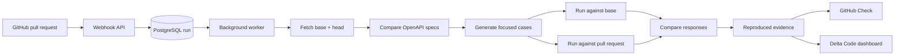

<p align="center">
  
</p>

<p align="center">
  <strong>Evidence-first API regression detection for pull requests.</strong>
</p>

<p align="center">
  Delta Code runs the same targeted requests against both sides of a pull
  request and shows the behavior that actually changed.
</p>

<p align="center">
  <a href="https://deltacode-tau.vercel.app/"><strong>Explore Delta Code</strong></a>
  ·
  <a href="api-verifier-spec.md">Product brief</a>
</p>

<p align="center">
  
  
  
  
  
</p>

---

## The problem

An API pull request can look harmless in a code diff while silently changing
what clients experience:

- an optional field becomes required;
- a missing resource changes from `404` to `200`;
- a valid payload starts returning `422`;
- an endpoint stops returning fields consumers depend on;
- an edge case that worked on the base branch begins producing a server error.

Code review and static analysis can suggest that something *might* be wrong,
but reviewers still need to know whether the change can be reproduced.

Delta Code answers a narrower, more useful question:

> **Did the same request behave differently on this pull request than it did
> on the base branch?**

## What Delta Code does

Delta Code connects to GitHub and evaluates API behavior whenever a monitored
pull request opens or changes.

It:

1. fetches the base and pull-request revisions;
2. reads and compares their OpenAPI specifications;
3. identifies the endpoints, fields, and parameters affected by the change;
4. generates focused edge cases for that changed surface;
5. starts both versions of the API;
6. sends equivalent requests to each version;
7. compares the observed responses;
8. stores only meaningful behavioral differences;
9. publishes the result as a GitHub Check;
10. makes the evidence available in the Delta Code dashboard.

The result is evidence a reviewer can inspect instead of a speculative warning.

## What the evidence looks like

```text
POST /items

Request
{ "name": "example", "price": 1.0 }

Base branch                 Pull request
201 Created          →      422 Unprocessable Entity
discount: 0.0               discount: Field required
```

Delta Code keeps the request, both responses, the status-code change, and the
test-case identity together so the finding can be reproduced and discussed.

## Finding semantics

| Finding | Meaning |
| --- | --- |
| `regression` | A request succeeded on the base branch but failed on the pull request. |
| `status_code_changed` | Both branches responded, but their status codes changed in another reviewable way. |
| No finding | The observed behavior was equivalent, or both versions already failed. The case is suppressed. |

This suppression is intentional. Delta Code focuses reviewers on behavior
introduced by the pull request rather than flooding them with every request it
attempted.

## How it works



The webhook stays fast by creating a run and handing the comparison to a
PostgreSQL-backed worker. The heavier work—checking out revisions, starting
both applications, running cases, and comparing responses—happens
asynchronously.

## The product experience

### GitHub-native verification

Delta Code reports directly on the pull request as a GitHub Check. Reviewers
can see whether verification passed, failed, or reproduced behavioral changes
without leaving the workflow where the code is being reviewed.

### Workspace overview

The dashboard summarizes:

- repositories available through the GitHub App;
- active and recently completed runs;
- repository health;
- recent pass rate and regression activity;
- verification history across the workspace.

### Run evidence

Each run includes:

- repository and pull-request context;
- base and head branches;
- base and head commit identifiers;
- run status and retry controls;
- clear failure information;
- reproduced requests;
- side-by-side base and pull-request responses;
- regression and behavior-change classifications.

### Repository access

Users can see which repositories Delta Code can access, distinguish public,
private, internal, and unknown visibility, and manage the GitHub App
installation through GitHub.

### Accessible themes

The interface is light-first with an optional low-glare dark theme. Both modes
use the same semantic status colors, visible focus states, readable response
evidence, reduced-motion support, and responsive layouts.

## Current capabilities

- OpenAPI-aware changed-surface detection.
- Generated cases for omitted fields, required-field changes, type changes,
  path parameters, and query parameters.
- Real base-versus-head execution.
- GitHub webhook verification and Check Run publishing.
- PostgreSQL-backed asynchronous run processing.
- Persisted findings, failures, and retry support.
- GitHub OAuth with repository-scoped dashboard authorization.
- Authenticated checkout support for selected private repositories.
- Workspace overview, run history, repository grouping, integrations, and
  account settings.
- Optional LLM-assisted case suggestions and finding explanations.
- Deterministic operation when no model is available.

## Who Delta Code is for

Delta Code is designed for:

- backend engineers reviewing API changes;
- teams maintaining FastAPI services;
- platform engineers responsible for pull-request quality gates;
- API owners who need concrete compatibility evidence;
- reviewers who want a faster path from code change to observable impact.

## Current scope

The active MVP is intentionally focused. Target repositories should currently:

- use Python and FastAPI;
- expose a working OpenAPI specification;
- have a predictable local startup path;
- run without complex external infrastructure, or provide local substitutes.

Support for additional frameworks, stateful multi-step scenarios,
authentication matrices, deeper response-schema comparison, and broader
execution environments belongs to future iterations.

## Security boundary

Repository access is controlled by the GitHub App installation. Dashboard
identity uses a separate GitHub OAuth flow, and run data is scoped to
repositories the signed-in user can access.

The current worker executes checked-out pull-request code in its worker
environment. Until that execution is fully sandboxed, Delta Code should be
treated as a trusted-development MVP rather than a general multi-tenant
execution service.

## Technology

| Area | Technology |
| --- | --- |
| API and webhooks | FastAPI |
| Run persistence | PostgreSQL |
| Background work | Procrastinate |
| API comparison | OpenAPI-derived cases and HTTP execution |
| GitHub integration | GitHub Apps, OAuth, and Check Runs |
| Dashboard | React, Next.js, TypeScript, and custom CSS |
| Optional AI enrichment | Ollama-compatible language models |

## Product direction

Completed foundations include deterministic OpenAPI diffing, targeted case
generation, real base-versus-pull-request execution, GitHub Checks, secure
dashboard sessions, private-repository checkout, and the expanded product
dashboard.

The next major product priorities are:

- sandboxed execution for untrusted pull-request code;
- deeper response-body and schema comparison;
- richer test-case generation informed by the pull-request diff;
- clearer evidence explanations and developer guidance;
- additional API frameworks and repository configurations;
- pagination, observability, and operational controls for larger workspaces.

## Project documentation

- [Product specification](api-verifier-spec.md)
- [Dashboard API contract](frontend-handoff.md)
- [Local development and contributor runbook](docs/LOCAL_DEVELOPMENT.md)

The development runbook keeps contributor setup and testing commands separate
from this product overview.

---

<p align="center">
  <strong>Delta Code</strong><br>
  Evidence, not speculation.
</p>
