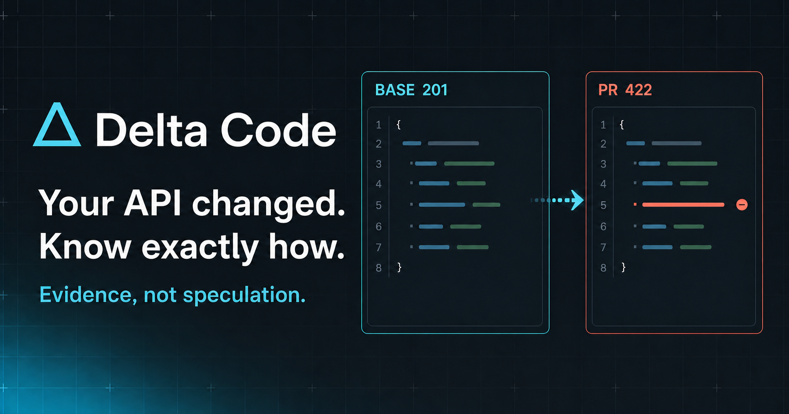
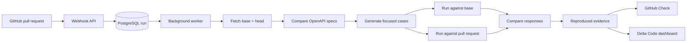

<p align="center">
  
</p>

<p align="center">
  <strong>Dependabot for APIs—repository-specific migrations with verification evidence.</strong>
</p>

<p align="center">
  Delta Code is evolving into an API change-management platform that connects
  official provider changes to affected code, verified migrations, and draft
  pull requests.
</p>

<p align="center">
  <a href="https://deltacode-tau.vercel.app/"><strong>Explore Delta Code</strong></a>
  ·
  <a href="docs/architecture/phase-0-rfc.md">Product RFC</a>
</p>

<p align="center">
  
  
  
  
  
</p>

---

## The problem

External API and SDK changes are announced separately from the code that
depends on them. Breaking changes can ship with little warning, useful features
go unnoticed, and developers must manually connect changelogs to dependencies,
call sites, code changes, tests, and rollout risk.

Package update tools can propose a version bump, and generic coding agents can
modify a repository when instructed. Neither establishes the complete causal
chain Delta Code is designed to provide:

> **An authoritative external change occurred; this repository is affected at
> these call sites; this patch performs the migration; and this evidence shows
> what passed, failed, or remains uncertain.**

The target workflow is:

> API change detected → change normalized from official sources → affected
> repositories and call sites identified → migration and tests generated →
> sandboxed verification → draft PR → automated review → developer decision.

## What Delta Code does today

The current implementation is the evidence-producing foundation for that
direction. It connects to GitHub and evaluates API behavior whenever a monitored
pull request opens or changes.

It:

1. fetches the base and pull-request revisions;
2. reads and compares their OpenAPI specifications;
3. identifies the endpoints, fields, and parameters affected by the change;
4. generates focused edge cases for that changed surface;
5. starts both versions of the API;
6. sends equivalent requests to each version;
7. compares the observed responses;
8. stores only meaningful behavioral differences;
9. publishes the result as a GitHub Check;
10. makes the evidence available in the Delta Code dashboard.

The result is evidence a reviewer can inspect instead of a speculative warning.

## What the evidence looks like

```text
POST /items

Request
{ "name": "example", "price": 1.0 }

Base branch                 Pull request
201 Created          →      422 Unprocessable Entity
discount: 0.0               discount: Field required
```

Delta Code keeps the request, both responses, the status-code change, and the
test-case identity together so the finding can be reproduced and discussed.

## Finding semantics

| Finding | Meaning |
| --- | --- |
| `regression` | A request succeeded on the base branch but failed on the pull request. |
| `status_code_changed` | Both branches responded, but their status codes changed in another reviewable way. |
| No finding | The observed behavior was equivalent, or both versions already failed. The case is suppressed. |

This suppression is intentional. Delta Code focuses reviewers on behavior
introduced by the pull request rather than flooding them with every request it
attempted.

## How it works



The webhook stays fast by creating a run and handing the comparison to a
PostgreSQL-backed worker. The heavier work—checking out revisions, starting
both applications, running cases, and comparing responses—happens
asynchronously.

## The product experience

### GitHub-native verification

Delta Code reports directly on the pull request as a GitHub Check. Reviewers
can see whether verification passed, failed, or reproduced behavioral changes
without leaving the workflow where the code is being reviewed.

### Workspace overview

The dashboard summarizes:

- repositories available through the GitHub App;
- active and recently completed runs;
- repository health;
- recent pass rate and regression activity;
- verification history across the workspace.

### Run evidence

Each run includes:

- repository and pull-request context;
- base and head branches;
- base and head commit identifiers;
- run status and retry controls;
- clear failure information;
- reproduced requests;
- side-by-side base and pull-request responses;
- regression and behavior-change classifications.

### Repository access

Users can see which repositories Delta Code can access, distinguish public,
private, internal, and unknown visibility, and manage the GitHub App
installation through GitHub.

### Accessible themes

The interface is light-first with an optional low-glare dark theme. Both modes
use the same semantic status colors, visible focus states, readable response
evidence, reduced-motion support, and responsive layouts.

## Current capabilities

- OpenAPI-aware changed-surface detection.
- Generated cases for omitted fields, required-field changes, type changes,
  path parameters, and query parameters.
- Real base-versus-head execution.
- GitHub webhook verification and Check Run publishing.
- PostgreSQL-backed asynchronous run processing.
- Persisted findings, failures, and retry support.
- GitHub OAuth with repository-scoped dashboard authorization.
- Authenticated checkout support for selected private repositories.
- Workspace overview, run history, repository grouping, integrations, and
  account settings.
- Optional LLM-assisted case suggestions and finding explanations.
- Deterministic operation when no model is available.
- Provider-neutral Phase 1 control-plane contracts, lifecycle persistence,
  cursor APIs, idempotent developer actions, and audit events.
- Phase 2 official-source ingestion with SSRF controls, immutable artifact
  capture, OpenAPI and structured-release normalization, provenance, health,
  deduplication, and repository fan-out.
- Phase 3 immutable repository snapshots, deterministic PyPI/npm dependency
  inventory, Python AST call-site analysis, explicit coverage outcomes, and
  affected migration fan-out without executing repository code.

## Who Delta Code is for

Delta Code is designed for:

- application teams that depend on third-party APIs and SDKs;
- platform engineers responsible for dependency and migration policy;
- API providers that want changes to be safely adoptable by customers;
- reviewers who need concrete evidence before accepting generated migrations;
- backend engineers validating observable API behavior.

## Current scope

The active MVP is intentionally focused. Target repositories should currently:

- use Python and FastAPI;
- expose a working OpenAPI specification;
- have a predictable local startup path;
- run without complex external infrastructure, or provide local substitutes.

Support for additional frameworks, stateful multi-step scenarios,
authentication matrices, deeper response-schema comparison, and broader
execution environments belongs to future iterations.

## Security boundary

Repository access is controlled by the GitHub App installation. Dashboard
identity uses a separate GitHub OAuth flow, and run data is scoped to
repositories the signed-in user can access.

The legacy API-comparison worker still executes checked-out pull-request code
in its worker environment. The Phase 4 migration path does not: it validates
structured edits in the trusted worker and sends all repository-controlled
commands to a separate Cloudflare Sandbox Worker with outbound traffic denied.
Hosted migration execution remains fail-closed until its explicit enablement
flag is set after isolation testing.

## Technology

| Area | Technology |
| --- | --- |
| API and webhooks | FastAPI |
| Run persistence | PostgreSQL |
| Background work | Procrastinate |
| API comparison | OpenAPI-derived cases and HTTP execution |
| GitHub integration | GitHub Apps, OAuth, and Check Runs |
| Dashboard | React, Next.js, TypeScript, and custom CSS |
| Optional AI enrichment | Ollama-compatible language models |

## Product direction

Delta Code is becoming a provider-independent API change-management and
migration platform. It will monitor official API and SDK sources, normalize
changes, identify affected repositories and call sites, generate code and tests,
verify migrations in a sandbox, open draft pull requests, review its own work,
and recommend approve, revise, snooze, or decline.

LLMs will interpret ambiguous source material, understand repository context,
generate migrations and tests, and explain uncertainty. Deterministic systems
will retain authority over source hashes, specification and SDK diffs,
dependency discovery, symbol analysis, compilation, tests, and behavioral
verification.

The accepted Phase 0 direction, domain model, contracts, schemas, and security
boundaries live in [the architecture directory](docs/architecture/README.md).

## Project documentation

- [API migration product RFC](docs/architecture/phase-0-rfc.md)
- [Architecture contracts](docs/architecture/README.md)
- [Phase 1 control-plane implementation](docs/architecture/phase-1-control-plane.md)
- [Phase 2 official-source ingestion](docs/architecture/phase-2-ingestion.md)
- [Phase 3 repository intelligence](docs/architecture/phase-3-repository-intelligence.md)
- [Phase 4 generation and sandbox verification](docs/architecture/phase-4-generation-and-sandbox.md)
- [Current dashboard API handoff](frontend/frontend-handoff.md)
- [Local development and contributor runbook](docs/LOCAL_DEVELOPMENT.md)

The development runbook keeps contributor setup and testing commands separate
from this product overview.

---

<p align="center">
  <strong>Delta Code</strong><br>
  Evidence, not speculation.
</p>
