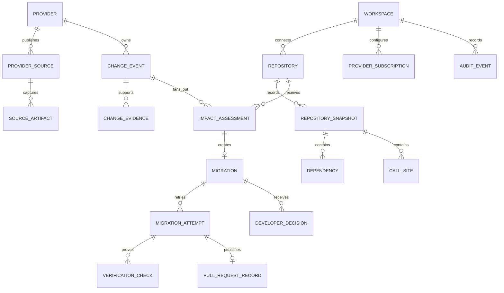
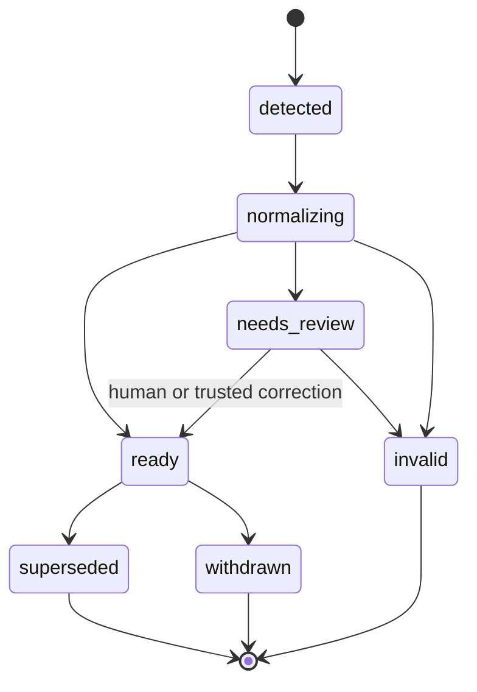
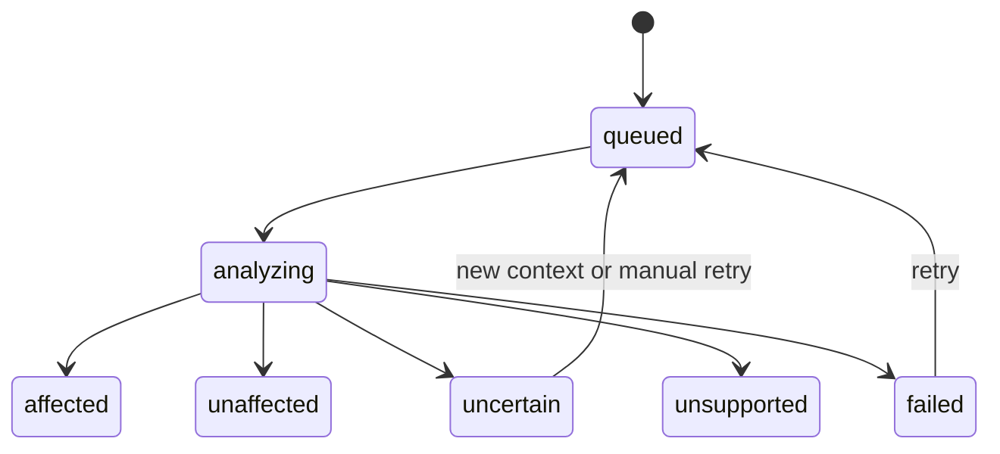
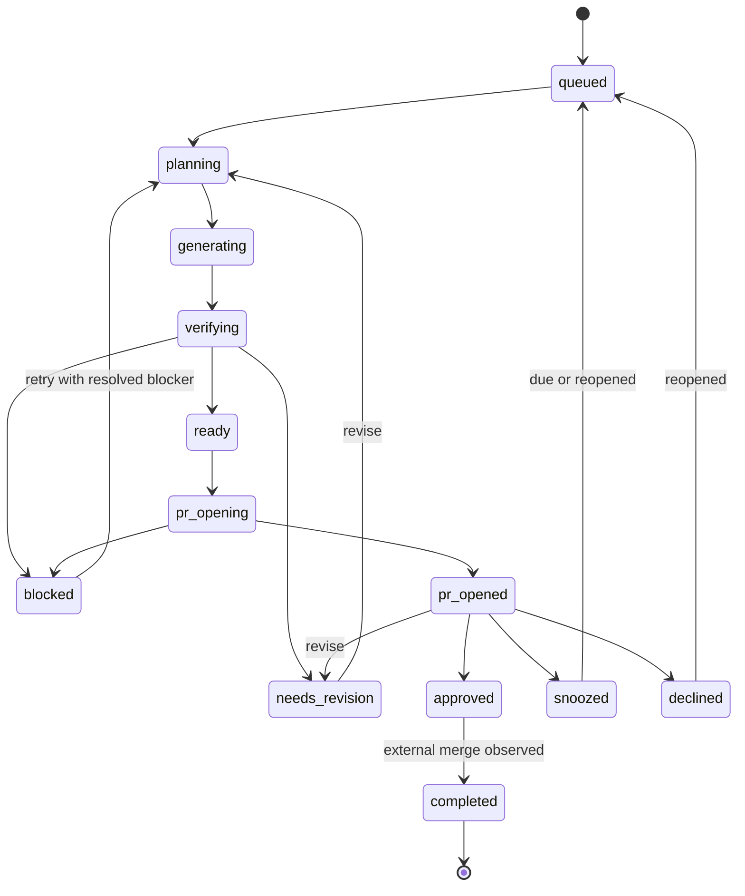

# Domain model and lifecycle

This document defines the durable nouns and state transitions used by the API,
workers, dashboard, GitHub publisher, and audit log. Implementation names may
vary, but their ownership and cardinality must remain consistent.

## Ownership hierarchy



Every tenant-owned record carries `workspace_id`, even while the hosted product
operates as a small single-workspace MVP. Provider catalog records may be
global, but subscriptions, repository data, migrations, decisions, and
artifacts are workspace-scoped.

## Core entities

### Workspace

The authorization and policy boundary. It owns repository connections,
provider subscriptions, migration policies, members, budgets, retention, and
audit events.

### Provider and provider source

`Provider` identifies an external API or SDK publisher. `ProviderSource`
describes one official machine-readable or human-readable feed: OpenAPI URL,
official changelog, SDK repository releases, package registry, migration guide,
or signed/manual submission.

Provider identity is independent from source format. A provider may have many
sources, and a change may cite more than one source.

### Source artifact

An immutable capture of fetched source material. It includes the canonical URL,
fetch time, content type, SHA-256 digest, retrieval status, and object-storage
reference. Artifacts provide provenance and reproducibility; mutable web pages
must not be treated as permanent evidence without a capture.

### Change event

A provider-independent description of one external change. It captures before
and after semantics, targets such as endpoints or SDK symbols, versions and
dates, authoritative evidence, severity, migration guidance, confidence, and
unresolved uncertainty.

Duplicate announcements should converge on one event through a stable
`dedupe_key`. Corrections create a new event linked with `supersedes`; they do
not mutate previously acted-upon evidence invisibly.

### Repository and repository snapshot

`Repository` represents the GitHub installation resource and workspace policy.
`RepositorySnapshot` is an immutable analysis input identified by commit SHA,
default branch, analyzer versions, and dependency/call-site inventory.

Snapshots allow impact decisions and migrations to be reproduced even when the
repository moves forward.

### Dependency

A deterministic observation from manifests, lockfiles, generated clients,
imports, configuration, or endpoint usage. It records ecosystem, package,
resolved version when available, source file, and detection method.

### Call site

A concrete repository location potentially related to a provider target. It
records file path, line range, language, symbol or endpoint, analyzer, evidence,
and confidence. A call site is not automatically affected; it becomes affected
through an impact assessment tied to a particular change event.

### Impact assessment

The result of evaluating one change event against one repository snapshot.
Allowed conclusions are:

- `affected`: supported evidence connects the change to repository usage.
- `unaffected`: sufficient supported analysis found no relevant usage.
- `uncertain`: evidence is incomplete or ambiguous.
- `unsupported`: the repository cannot be analyzed with available capabilities.
- `failed`: an operational failure prevented a conclusion.

`unaffected` requires coverage evidence. Absence of findings from an unsupported
analyzer must never be translated into `unaffected`.

### Migration

The long-lived repository-specific work item created from an affected or
human-promoted uncertain assessment. It owns risk, policy, current attempt,
decision state, snooze state, and PR relationship.

There is at most one active migration per `(workspace, change_event,
repository)` unless an explicit superseding migration is created.

### Migration attempt

An immutable execution of planning, generation, verification, and review.
Revision feedback creates a new attempt linked to its predecessor. Each attempt
records input snapshot, model and tool versions, prompt/template versions,
patch artifact, tests, verification checks, recommendation, costs, and timing.

### Verification check

A structured result for dependency installation, formatting, linting,
type-checking, build, unit tests, generated tests, behavioral verification, or
policy checks. Command output is evidence only when it came from the sandbox
executor and includes its exit status and artifact digest.

### Pull request record

The GitHub branch, commit, draft PR, head SHA, URL, publication status, and last
synchronized attempt. GitHub is an external projection; the migration and its
attempt evidence remain the internal source of truth.

### Developer decision

An append-only action with actor, timestamp, reason, target attempt, and
metadata:

- `approve`: mark the generated draft ready for normal human review.
- `revise`: request another attempt with bounded instructions.
- `snooze`: defer until a timestamp, provider version, or effective date.
- `decline`: stop work and optionally close the generated draft PR.
- `reopen`: explicitly reactivate a declined or snoozed migration.

Approve does not merge code in the initial product.

### Audit event

An immutable record of security-sensitive and user-visible state changes,
including repository access changes, provider-source changes, job transitions,
token-broker operations, PR publication, policy changes, and developer actions.
Secret values and raw tokens are never audit fields.

## Change-event lifecycle



- `detected`: one or more new source artifacts require processing.
- `normalizing`: adapters and validators are producing the common model.
- `needs_review`: authoritative material exists but normalization is ambiguous.
- `ready`: valid for repository fan-out.
- `invalid`: duplicate noise, unauthoritative, malformed, or not a real change.
- `withdrawn`: provider retracted the change.
- `superseded`: a correction or later event replaces it.

Only `ready` events automatically fan out to repositories.

## Impact-assessment lifecycle



An assessment records a capability report so `unaffected` can be distinguished
from “not analyzed.” A new repository commit or analyzer version creates a new
assessment rather than mutating the old conclusion.

## Migration lifecycle



`ready` means the attempt has completed its configured verification policy; it
does not imply every check passed. The recommendation and unresolved failures
determine whether the publisher may open a draft under workspace policy.

## Attempt lifecycle

```text
created → planning → generating → verifying → reviewing → completed
                   ↘ failed      ↘ failed     ↘ failed
                   ↘ cancelled
```

Attempts are terminal after `completed`, `failed`, or `cancelled`. No job may
rewrite a terminal attempt. A retry creates another attempt with
`previous_attempt_id` and a new idempotency key.

## Invariants

1. Every provider claim cites at least one source artifact.
2. Every affected call site belongs to the analyzed repository snapshot.
3. Every migration belongs to exactly one change event and repository.
4. Every check belongs to exactly one immutable attempt.
5. Deterministic results and model interpretations have separate provenance.
6. A PR can only publish a stored patch from a completed attempt.
7. The GitHub publisher cannot alter the patch it receives.
8. `unaffected` is invalid without a successful capability/coverage report.
9. Tokens, secret values, and unredacted environment variables are never domain
   fields or artifacts.
10. Every external write and developer decision produces an audit event.

## Idempotency and concurrency

- Source artifacts deduplicate on canonical source plus content digest.
- Change events deduplicate on provider plus normalized semantic key.
- Repository fan-out deduplicates on change event plus snapshot.
- Active migrations are unique by workspace, change event, and repository.
- Attempts use a caller-supplied idempotency key.
- PR publication uses migration plus attempt and verifies the remote head SHA.
- Workers claim transitions with compare-and-set semantics; stale jobs may not
  advance entities whose expected state or version changed.

## Retention

Metadata and audit records are retained according to workspace policy. Source
artifacts, patches, and logs use immutable object references with independent
retention. Deleting a repository connection prevents new access and schedules
repository content artifacts for deletion without erasing minimum audit facts
required for security and billing records.
