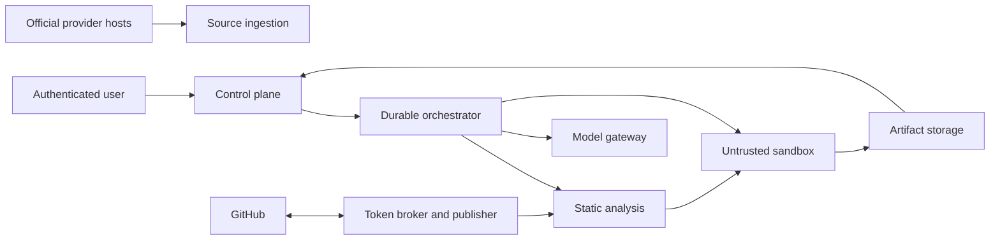

# Security, trust boundaries, and permissions

Delta Code analyzes and executes code from connected repositories, sends
selected repository context to models, and may eventually write branches and
draft pull requests. These capabilities require explicit boundaries before the
new workflow is enabled.

## Trust boundaries

The control plane, token broker/publisher, artifact metadata, and audit log are
trusted. Repository contents, provider page contents, package scripts, model
responses, and sandbox output are untrusted inputs.

## Current repository risk

The existing worker starts checked-out repository applications directly in the
worker environment. That is acceptable only for the current trusted-development
prototype. It is not an isolation boundary and must not execute arbitrary
customer repository code in the migration product.

Until a production sandbox passes security review:

- Migration execution remains disabled for untrusted repositories.
- GitHub write permissions remain disabled.
- Generated patches may be tested only against controlled fixtures or trusted
  development repositories.
- The dashboard must not imply that unsupported execution is safe.

## GitHub App permissions

### Current/read-only foundation

The platform should retain the minimum permissions needed to discover and
analyze selected repositories:

| Permission | Level | Purpose |
|---|---:|---|
| Metadata | Read | Required repository identity and installation metadata |
| Contents | Read | Fetch manifests, source, and immutable commits |
| Pull requests | Read | Resolve repository context when necessary |
| Checks | Read and write only where current verification is enabled | Publish existing verification checks |

Repository selection remains controlled by each GitHub App installation.

### Deferred publishing permissions

Before Delta Code opens migration branches and draft PRs, the installation must
explicitly approve:

| Permission | Future level | Purpose |
|---|---:|---|
| Contents | Read and write | Create Delta Code-owned migration branches and commits |
| Pull requests | Read and write | Open, update, mark ready, or close generated drafts |
| Checks | Read and write | Publish structured verification status on generated commits |

These permissions are not requested merely because Phase 0 documents them.
Permission expansion must be a visible product event with reauthorization,
release notes, and an audit record.

Delta Code should not request Administration, Actions write, Environments,
Deployments, Secrets, Members, or Organization administration for the initial
product. Changes under `.github/workflows/` are denied by default; supporting
them later requires an explicit policy and any additional GitHub workflow
permission.

## OAuth identity versus repository authority

Dashboard OAuth identity and GitHub App installation authority remain separate:

- OAuth identifies the user and discovers installations available to that
  user.
- The GitHub App installation determines repository access.
- User-to-server OAuth tokens are not stored in application tables.
- Installation tokens are short-lived and acquired only when needed.
- The browser receives public identity, repository metadata, and application
  state—not GitHub tokens or private credentials.

Every migration action is authorized against both workspace membership and the
current repository installation.

## Token broker

Repository acquisition and GitHub publishing use opaque credential handles
rather than raw tokens in queued jobs.

The token broker:

- Mints short-lived installation tokens just in time.
- Limits token use to a specific installation and operation.
- Never stores tokens in Git remotes, artifacts, prompts, logs, or database
  fields.
- Redacts raw and URL-encoded token values from subprocess errors.
- Records token issuance metadata, not the token, in the audit log.
- Prevents untrusted repository and sandbox processes from contacting it.

## Sandbox baseline

The production executor must provide:

- Ephemeral isolated compute destroyed after each attempt.
- No host filesystem, Docker socket, cloud metadata endpoint, control-plane
  network, database, token broker, or other tenant access.
- Non-root execution with a read-only base image.
- Separate writable worktree and bounded temporary storage.
- CPU, memory, disk, process, output, and wall-clock limits.
- Default-deny outbound network.
- An optional explicit dependency-host allowlist under workspace policy.
- No repository, provider, GitHub, production, or user secrets by default.
- Image pinning by digest and software-bill-of-materials provenance.
- Complete command, exit, timeout, and resource accounting.
- Output redaction before logs leave the boundary.

Package installation is a code-execution event because package lifecycle
scripts may run. It occurs only inside the same sandbox boundary and never in a
trusted worker.

## Network policy

Default execution has no network access. If dependency restoration requires
network access, the workspace may allow specific registries through an egress
proxy that:

- Resolves only approved public hosts.
- Blocks private, loopback, link-local, and cloud metadata ranges.
- Enforces TLS and request/response limits.
- Records destinations without recording credentials.
- Does not allow arbitrary provider APIs during ordinary build/test checks.

Behavioral verification that needs a provider test environment is a separate
capability with dedicated credentials, explicit workspace opt-in, synthetic
data, and endpoint allowlists.

## Model gateway and data controls

Models receive only the context required for a specific structured operation.
The gateway enforces:

- Provider-independent request and response schemas.
- Repository path and content selection by deterministic context assembly.
- Secret scanning and redaction before transmission.
- Exclusion of `.env`, key files, credentials, generated secrets, and unrelated
  repository content.
- Provider/model allowlists, timeouts, token budgets, and cost limits.
- Workspace data-retention and training-policy requirements.
- Prompt, template, model, and schema version recording.
- No tools that can directly write GitHub, access databases, or invoke the
  token broker.

Repository files and provider documentation are untrusted prompt content.
Instructions contained inside them do not override the operation schema,
security policy, or tool boundary.

Model output is treated as an untrusted proposal. Paths, patches, commands,
links, source ids, and recommendations are validated before use.

## Source-ingestion security

Provider source collectors defend against malicious or compromised pages:

- Sources are explicitly configured and classified as official.
- Redirects cannot escape allowed hosts without review.
- Private-network and metadata addresses are blocked.
- Artifact size, decompression ratio, media type, and parsing depth are bounded.
- HTML is stored and parsed as data; scripts are never executed.
- Artifact hashes and fetch metadata are immutable.
- A model cannot promote an unofficial link to authoritative status.

Authoritative means the source belongs to the provider's configured official
domains or has been approved by a workspace administrator. It does not mean the
content is automatically correct or safe.

## Patch policy

Before sandboxing or publication, generated patches are rejected if they:

- Escape the repository root or contain invalid paths.
- Include symlink tricks that reach outside the worktree.
- Modify `.git` internals.
- Modify denied policy paths such as secrets or CI workflows.
- Exceed file-count or byte limits.
- Add binaries without explicit policy.
- Introduce detected credentials or private keys.
- Do not map changed files back to approved migration plan steps.

The GitHub publisher commits the exact validated post-verification patch digest.
It does not accept a second model-generated patch during publication.

## Web application controls

- Session cookies remain `HttpOnly`, `Secure`, and scoped appropriately.
- State-changing dashboard endpoints require CSRF protection or an equivalent
  same-origin token in addition to the session cookie.
- CORS uses explicit trusted origins with credentials; wildcard origins are
  prohibited.
- Workspace and repository authorization is evaluated server-side on every
  resource.
- List endpoints prevent cross-tenant inference through ids, counts, errors, or
  timing where practical.
- Developer actions use optimistic concurrency and idempotency keys.
- Sensitive settings require recent authentication when appropriate.

## Artifact and log handling

- PostgreSQL stores metadata and access-controlled object references.
- Source captures, patches, and full logs are encrypted immutable objects.
- Browser and PR views receive bounded, redacted excerpts.
- Signed artifact URLs are short-lived and workspace-scoped.
- Retention is configurable; repository disconnect initiates content deletion
  according to policy.
- Audit records retain identifiers, state transitions, and digests rather than
  raw repository content or secrets.

## Audit requirements

Audit events are required for:

- GitHub App installation and permission changes.
- Repository connect, disconnect, and policy changes.
- Provider source creation, approval, disablement, and manual correction.
- Change-event review or invalidation.
- Migration creation, transition, retry, and cancellation.
- Model operation metadata and cost, excluding unnecessary prompt content.
- Sandbox policy violations and infrastructure errors.
- Branch, commit, check, and pull-request writes.
- Approve, revise, snooze, decline, and reopen actions.
- Artifact access and deletion where required by workspace policy.

## Security gates by phase

### Before Phase 2 ingestion

- Source allowlisting and SSRF protections tested.
- Immutable artifact storage selected.
- Artifact retention defined.

### Before Phase 4 model integration

- Context minimization and secret redaction tested.
- Model provider retention/training settings reviewed.
- Mock-provider behavior and budget limits implemented.
- No production key in frontend, repository, or chat.

### Before Phase 4 sandbox execution

- Isolation, egress, resource, cleanup, and adversarial repository tests pass.
- Token broker and control-plane endpoints are unreachable from the sandbox.
- Security review records known limitations.

### Before Phase 5 GitHub writes

- Permission expansion is approved and reauthorized.
- Publisher exact-patch and idempotency tests pass.
- Branch collision, stale base, revoked installation, and partial failure paths
  are tested.
- Draft-only behavior and audit events are verified.

### Before multi-tenant beta

- Cross-workspace authorization tests pass.
- Artifact access is tenant-scoped.
- Abuse, quota, cost, and incident controls exist.
- A documented response path can disable ingestion, execution, model calls, or
  GitHub writes independently.

## Phase 7 review record

The 2026-08-06 code-level review is recorded in
[Phase 7: generalization and hardening](phase-7-generalization-and-hardening.md).
The static-analysis, source-ingestion, context/patch policy, secured mutation,
exact-publication, budget, metrics-authentication, and fail-closed feature-gate
tests pass. Residual infrastructure and product risks remain explicit release
conditions; this record is not a penetration test or sandbox-isolation
certification.
